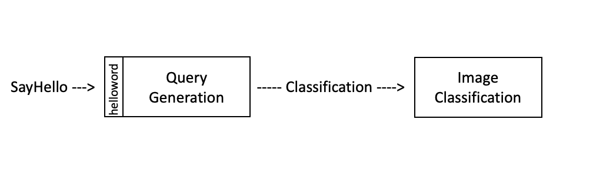

# Image Classification

This benchmark consists of 2 functions:

- The Query Generation function sends queries to the image classfication function. Currently it supports two types of queries: `Offline`(send all queries at one time) and `SingleStream`(send the next query as soon as previous one is completed). 

- The Image classification function uses `Resnet50` model, and currently only support `Imagenet2012 val` dataset.

## Parameters
- `scenario` - {'SingStream','Offline'}
- `threads`
- `qps`
- `max-latency`
- `time`: limit the time benchmark run